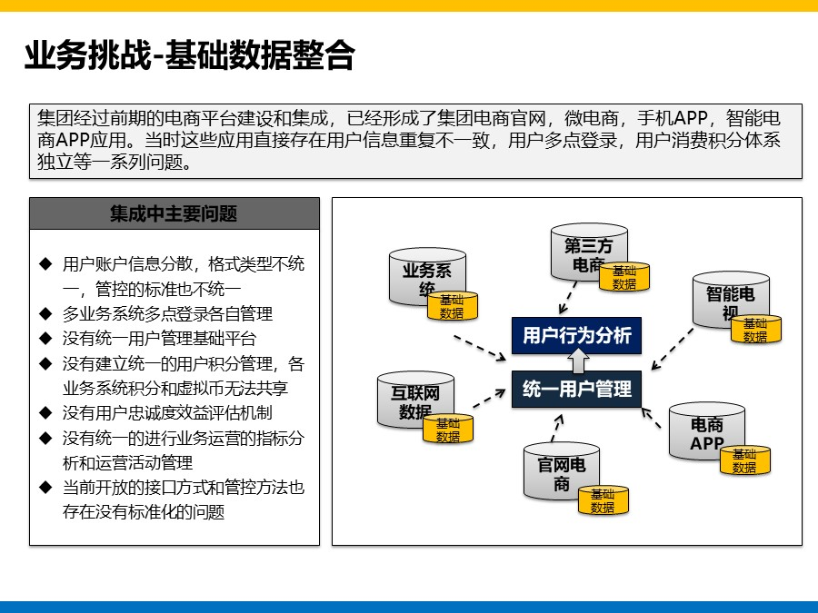
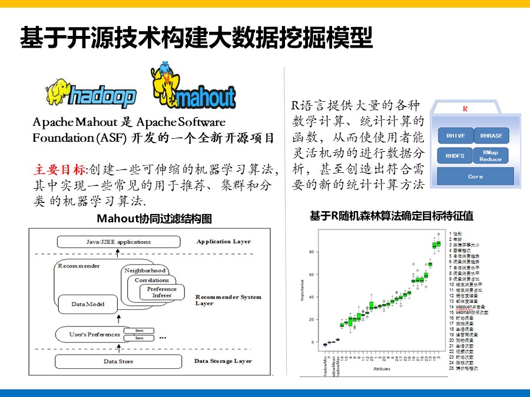

__集团大数据平台和用户系统建设方案总结和分享__

Date:2020-11-03

摘自：[人月神话](http://blog.sina.com.cn/s/blog_493a84550102z9p2.html)

>今天整理和分享下前几天进行一个「企业大数据平台」建设项目的方案材料，其中对相关的一些内容进行了  _删减_  和  _脱敏_  ，但是整体解决方案文档仍然是完整的。

对于这个应标方案，实际上用户是希望构建一个大数据平台，并基于大数据基础平台来构建大数据分析能力，同时用户在当前业务流程中已经遇到了来自电商，微信，电视终端多点用户接入，用户信息不统一的问题，因此构建一个完整的用户系统也成为该项目的一个关键内容。

简单来考虑就是，构建大数据平台进行大数据分析，生成用户画像和针对性营销是最终目标，但是在整个目标过程中又分解了解决当前多系统用户接入下的用户统一管理问题，因此整体的项目架构逻辑仍然是完成的。

大数据平台本身是一个技术基础平台，如果没有真实的业务场景驱动，那么技术平台本身没有任何价值。对于大数据平台来说，同样是业务场景驱动下面临的海量数据的存储和处理问题，才是需要大数据技术平台来支撑。

**重新对PPT方案进行复盘**

本项目解决方案的整体架构基本没有问题，即从项目背景和需求分析出发，引出项目整体解决方案，解决方案本身分了  __大数据平台构建和用户系统建设__  两个方面的内容，然后再分两个章节进行描述，最后介绍项目实施方案。

今天重新回顾这个方案，梳理如下：

对于项目概述部分，基于项目背景梳理了项目当前的挑战和面临的主要问题，提出项目的目标和范围，但是中间还是缺少了关键衔接。即应该基于问题痛点进行需求分析，基于需求分析后整理最终的项目目标。
类似如下方式：

【图 002】

 
在项目整体解决方案部分，给出项目整体架构。这个我在前面售前方案材料整理文章里面也谈到过，这个地方整体解决方案实际上涉及到两个方面的呈现，其一是静态整体架构图，其二是从动态业务流程运转支撑上面，当前在动态层面缺少。

整体解决方案给出后，实际需要进一步整理清楚两个方面的内容，其一是方案里面的各个子系统之间的集成和衔接关系要说清楚，其二是最终方案是如何来支撑目标的要讲解清楚。

对于售前方案制作，我在前面专门写过一篇文章供参考：
[对IT项目售前解决方案制作的一些思考](https://www.toutiao.com/i6864177270131524107/?group_id=6864177270131524107)

在大数据平台构建章节部分内容，我们基本数据存储采集，数据处理，统一调度，数据服务总线，数据可视化分析几个层面展开进行阐述本身没有问题。但是缺少的还是给出了一个大而全的大数据平台技术方案，反而会导致整个技术平台方案没有针对性。

*那么出现这种情况的实际原因在哪里？*

简单来说还是前期对客户本身的业务需求和技术需求调研的不全面，你前期对业务，对当前客户的IT架构，技术架构调研的不全面，导致你很难给出又针对性的建设方案。更加难以基于客户的业务场景方式来对方案进行阐述。这个内容实际是在技术方案应标里面的一个关键内容，如果没有做好，往往会直接影响到项目方案的技术评分。

【图003 ~ 061】
**方案材料分享**

--END--
